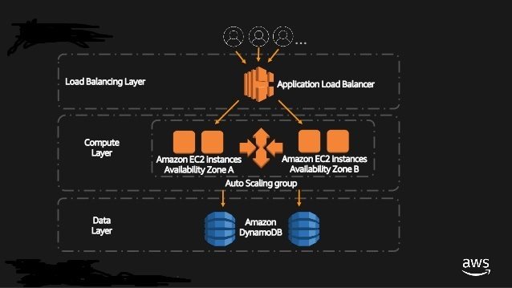

# examen-ml

Magneto quiere reclutar la mayor cantidad de mutantes para poder luchar contra los X-Men.

- Enunciado
[link](https://github.com/pdbenitez/examen-ml/blob/master/exercise/Examen%20Mercadolibre%202017%20-%20Mutantes.pdf)


## Prerequisites

Es necesario tener instalado:

```
Java 8
Maven
DynamoDB
```


## Installing

- Clonar el repositorio. git clone https://github.com/pdbenitez/examen-ml.git
- Bajar las dependencias, ejecutar los tests mvn test
- Descargar DynamoDB para ejecucion local: [Descarga](https://docs.aws.amazon.com/es_es/amazondynamodb/latest/developerguide/DynamoDBLocal.html)
- Levantar DynamoDB, chequear que este todo bien entrando a http://localhost:8000/shell/
- En la shell de DynamoDB crear 2 tablas e insertar un registro:

```javascript
/*Tabla que va a contener todos los ADN*/
var params = {TableName: 'PersonsDna', KeySchema: [ {AttributeName: 'Dna',KeyType: 'HASH',}],
AttributeDefinitions: [ { AttributeName: 'Dna', AttributeType: 'S',	}],
ProvisionedThroughput: {ReadCapacityUnits: 1, WriteCapacityUnits: 1, }};
dynamodb.createTable(params, function(err, data) { if (err) ppJson(err); else ppJson(data); });

/*Tabla que va a funcionar como contador de humanos y mutantes*/
var params = {TableName: 'DnaCounters',KeySchema: [{AttributeName: 'dna',KeyType: 'HASH',}],
AttributeDefinitions: [{AttributeName: 'dna',AttributeType: 'S',}],
ProvisionedThroughput: {ReadCapacityUnits: 1,WriteCapacityUnits: 1,}};
dynamodb.createTable(params, function(err, data) { if (err) ppJson(err); else ppJson(data);});

/*Registro base que luego se incrementara segun el tipo de ADN que se consulte*/
var params = {TableName: 'DnaCounters', Item: {dna: 'DNA',count_mutant_dna: 0,count_human_dna: 0}};
console.log("Calling PutItem"); ppJson(params);
docClient.put(params, function(err, data) { if (err) ppJson(err); else console.log("PutItem returned successfully");});
```

- Levantar la app local (Puerto 8081 por default, se puede modificar en el archivo application.properties): mvn spring-boot:run


## Usage

La api /mutant/ detecta si un ADN de un humano es mutante o no mediante un HTTP POST con un Json el cual tenga el siguiente formato:

POST → ScaleItUpDemoELB-847883525.us-east-1.elb.amazonaws.com/mutant/

POST → localhost:8081/mutant/


{
"dna":["ATGCGA","CAGTGC","TTATGT","AGAAGG","CCCCTA","TCACTG"]
}

En caso de verificar un mutante, devuelve un HTTP 200-OK, en caso contrario un 403-Forbidden.


La api /stats devuelve un Json con las estadisticas de las verificaciones de ADN:

 {"count_mutant_dna":40, "count_human_dna":100, "ratio":0.4}

GET → ScaleItUpDemoELB-847883525.us-east-1.elb.amazonaws.com/stats

GET → localhost:8081/stats


## Architecture



 

## Overview

Se decidio usar un Load Balancer con un server como base para que luego segun la carga escale horizontalmente, cuando supere ciertos limites (75% como limite superior de cpu/average para agregar un nuevo server y 15% como limite inferior de cpu/average para apagar un server).

Para acompañar la decision, se opto como base de datos, DynamoDB de Amazon por su feature de autoscaling que se ajusta de forma dinamica y automatica en base al trafico que reciba, que hace que su capacidad de lectura o escritura aumente o disminuya, segun corresponda.


## Considerations

Para el algoritmo de deteccion de mutantes se uso una comparacion de 4 letras (char) la que devuelve si son iguales o no.
A medida que se recorre la matriz de un ADN, se comparan letras en forma horizontal, vertical y oblicua en una misma iteracion para mayor eficiencia. Cuando se termina una iteracion se decide si continuar o no en la busqueda de secuencias de ADN mutantes.

Cuando un ADN se consulta por primera vez, se realiza la busqueda mediante el algoritmo descripto anteriormente, luego se guarda en DynamoDB el ADN con un resultado (true/false) y por ultimo se actualiza el contador de mutantes/humanos. Luego si ese mismo ADN se vuelve a consultar simplemente se busca el resultado en DynamoDB para no pasar nuevamente por el algoritmo.
